# SZT-bigdata 深圳地铁大数据客流分析系统 🚇🚇🚇

<div align="center">
	<a href="https://github.com/geekyouth/SZT-bigdata" target="_blank">
		
	</a>
</div>

---

<div align="center">
	<a href="https://github.com/geekyouth/SZT-bigdata/stargazers" target="_blank">   
		
	</a>	
	<a href="https://github.com/geekyouth/SZT-bigdata/network/members" target="_blank"> 
		
	</a>	
	<a href="https://github.com/geekyouth/SZT-bigdata/watchers" target="_blank">
		
	</a>	
	<a href="https://github.com/geekyouth/SZT-bigdata/releases" target="_blank">
		
	</a>	
	<a href="https://github.com/geekyouth/SZT-bigdata/issues" target="_blank">  
		
	</a>	
	<a href="https://github.com/geekyouth/SZT-bigdata/blob/master/LICENSE" target="_blank">
		
	</a>	
	<br/>
	<a href="https://java666.cn" target="_blank">
		
	</a>
</div>

---


```
   ___     ____   _____           _         _      __ _      _             _
  / __|   |_  /  |_   _|   ___   | |__     (_)    / _` |  __| |   __ _    | |_    __ _
  \__ \    / /     | |    |___|  | '_ \    | |    \__, | / _` |  / _` |   |  _|  / _` |
  |___/   /___|   _|_|_   _____  |_.__/   _|_|_   |___/  \__,_|  \__,_|   _\__|  \__,_|
_|"""""|_|"""""|_|"""""|_|     |_|"""""|_|"""""|_|"""""|_|"""""|_|"""""|_|"""""|_|"""""|
"`-0-0-'"`-0-0-'"`-0-0-'"`-0-0-'"`-0-0-'"`-0-0-'"`-0-0-'"`-0-0-'"`-0-0-'"`-0-0-'"`-0-0-'
```
---

## 项目说明🚩：
- 🎈 该项目主要分析深圳通刷卡数据，通过大数据技术角度来研究深圳地铁客运能力，探索深圳地铁优化服务的方向；
- ✨ 强调学以致用，本项目的原则是尽可能使用较多的常用技术框架，加深对各技术栈的理解和运用，在使用过程中体验各框架的差异和优劣，为以后的项目开发技术选型做基础；
- 👑 解决同一个问题，可能有多种技术实现，实际的企业开发应当遵守最佳实践原则；
- 🎉 学习过程优先选择较新的软件版本，因为新版踩坑一定比老版更多，坑踩的多了，技能也就提高了，遇到新问题可以见招拆招、对症下药；
- 🚀 ...

---
## 第一期架构图
原图 [.file/.doc/SZT-bigdata-2.png](.file/.doc/SZT-bigdata-2.png)  


```
数字标记不分先后顺序，对应代码：
1-cn.java666.sztcommon.util.SZTData
2-cn.java666.etlflink.app.Jsons2Redis
3-cn.java666.etlspringboot.controller.RedisController#get
4-cn.java666.etlflink.app.Redis2ES
5-cn.java666.etlflink.app.Redis2Csv
6-Hive sql 脚本（开发维护成本最低）
7-Saprk 程序（开发维护成本最高，但是功能更强）
8-HUE 方便查询和展示 Hive 数据
9-cn.java666.etlflink.app.Redis2HBase
10、14-cn.java666.szthbase.controller.KafkaListen#sink2Hbase
11-cn.java666.etlflink.app.Redis2HBase
12-CDH HDFS+HUE+Hbase+Hive 一站式查询
13-cn.java666.etlflink.app.Redis2Kafka
15-cn.java666.sztflink.realtime.Kafka2MyCH
16-cn.java666.sztflink.realtime.sink.MyClickhouseSinkFun

```

**下一步，计划开发数据湖中台解决方案**

---

## 核心技术栈 + 版本选择 + 点评 (持续更新)⚡：
  

- Java-1.8/Scala-2.11，生态丰富，轮子够多；   
- Flink-1.10，流式业务、ETL 首选。发展势头如日中天，阿里巴巴背书，轻快灵活、健步如飞；就问你信不信马云？？？😚😚😚  
- Redis-3.2，天然去重，自动排序，除了快还是快。廉价版硬盘实现同类产品 SSDB。Win10|CentOS7|Docker Redis-3.2 三选一，CentOS REPL yum 安装默认使用3.2版本；  
- Kafka-2.1，消息队列业务解耦、流量消峰、订阅发布场景首选。最佳 CP：kafka-eagle-1.4.5，集生产、消费、Ksql、大屏、监控、报警于一身，同时监控 zk。其他我用过的 Kafka 监控组件最后都放弃了：  
	- KafkaOffsetMonitor 问题太多，丑拒；  
	- Kafka Manager，已更名为 CMAK，老外写的软件用起来就觉得很别扭，而且最高只兼容 Kafka 0.11，但是 Kafka 官方已经升级到 2.4 了啊喂；  
	- 其他各种开源的 Kafka 监控基本都试过，一个能打的都没有。
- Zookeeper-3.4.5，集群基础依赖，选举时 ID 越大越优势，通过会话机制维护各组件在线状态；  
- CDH-6.2，解决了程序员最难搞的软件兼容性问题，全家桶服务一键安装；  
- Docker-19，最快速度部署一款新软件，无侵入、无污染、快速扩容、服务打包。如果当前没有合适的运行环境，那么 docker 一定是首选；  
- SpringBoot-2.13，通用 JAVA 生态，敏捷开发必备；  
- knife4j-2.0，前身为 swagger-bootstrap-ui，REST API 项目调试简直不要太方便，秒杀原版丝袜哥十个数量级；  
- Elasticsearch-7，全文检索领域唯一靠谱的数据库，搜索引擎核心服务，亿级数据毫秒响应，真实时，坑也多🔊🔊🔊；  
- Kibana-7.4，ELK 全家桶成员，前端可视化，小白也不怕；  
- ClickHouse，家喻户晓的 nginx 服务器就是俄罗斯的代表作，接下来大红大紫的 clickhouse 同样身轻如燕，但是性能远超目前市面所有同类数据库，存储容量可达PB级别。目前资料还不多，正在学习中；  
- MongoDB-4.0，文档数据库，对 Json 数据比较友好，主要用于爬虫数据库；  
- Spark-2.3，目前国内大数据框架实时微批处理、离线批处理主流方案。这个组件太吃资源了，曾经在我开发时，把我的笔记本搞到蓝屏，于是我直接远程提交到 spark 集群了。接下来预计 Flink 开始表演了🦘，真的用了更快的框架就爱上了😍😍😍；  
- Hive-2.1，Hadoop 生态数仓必备，大数据离线处理 OLAP 结构化数据库，准确来说是个 HQL 解析器，查询语法接近 Mysql，就是窗口函数比较复杂😭😭😭；  
- Impala-3.2，像羚羊一样轻快矫健，同样的 hive sql 复杂查询，impala 毫秒级返回，hive 却需要80秒左右甚至更多；  
- HBase-2.1 + Phoenix，Hadoop 生态下的非结构化数据库，HBase 的灵魂设计就是 rowkey 和多版本控制，凤凰嫁接 hbase 可以实现更复杂的业务；  
- Kylin-2.5，麒麟多维预分析系统，依赖内存快速计算，但是局限性有点多啊，适用于业务特别稳定，纬度固定少变的场景，渣渣机器就别试了，内存太小带不起；  
- HUE-4.3，CDH 全家桶赠送的，强调用户体验，操作数仓很方便，权限控制、hive + impala 查询、hdfs 文件管理、oozie 任务调度脚本编写全靠他了；  
- 阿里巴巴 DataX，异构数据源同步工具，主持大部分主流数据库，甚至可以自己开发插件，马云家的东西，我选你！！！如果你觉得这还满足不了你的特殊业务需求，那么推荐你用 FlinkX，基于 Flink 的分布式数据同步工具。理论上你也可以自己开发插件；   
- Oozie-5.1，本身 UI 奇丑，但是配合 HUE 食用尚可接受，主要用来编写和运行任务调度脚本；  
- Sqoop-1.4，主要用来从 Mysql 导出业务数据到 HDFS 数仓，反过来也行；  
- Mysql-5.7，程序员都要用的吧，如果说全世界程序员都会用的语言，那一定是 SQL。Mysql 8.0 普及率不够高，MariaDB 暂不推荐，复杂的函数不兼容 Mysql，数据库这么基础的依赖组件出了问题你就哭吧；   
- Hadoop3.0（HDFS+Yarn），HDFS 是目前大数据领域最主流的分布式海量数据存储系统，这里的 Yarn 特指 hadoop 生态，主要用来分配集群资源，自带执行引擎 MR；  
- 阿里巴巴 DataV 可视化展示；   
- ...  

> 我发现越来越多的国产开源软件用户体验值得肯定。。。

---

## 准备工作🍬：
以下是我的开发环境，仅作参考：

- Win10 IDEA 2019.3 旗舰版，JAVA|Scala 开发必备，集万般功能于一身；
- Win10 DBeaver 企业版 6.3，秒杀全宇宙所有数据库客户端，几乎一切常用数据库都可以连，选好驱动是关键；
- Win10 Sublime Text3，地表最强轻量级编辑器，光速启动，无限量插件，主要用来编辑零散文件、markdown 实时预览、写前端特别友好（虽然我不擅长🖐🖐🖐），速度快到完全不用担心软件跟不上你的手速；
- 其他一些实用工具参考我的博客：<a href="https://java666.cn/#/AboutMe" target="_blank">https://java666.cn/#/AboutMe</a>
- CentOS7 CDH-6.2 集群，包含如下组件，对应的主机角色和配置如图，集群至少需要40 GB 总内存，才可以满足基本使用，不差钱的前提下，RAM 当然是合理范围内越大越好啦，鲁迅都说“天下武功唯快不破”；我们的追求是越快越好；  

   

   

   

如果你选用原版 Apache 组件搭建大数据集群，那么你会有踩不完的坑。我的头发不够掉了，所以我选 CDH！！！⚙🛠😏😏😏


---

## 数据源🌍：
- 深圳市政府数据开放平台，深圳通刷卡数据 133.7 万条【离线数据】貌似已经停止服务😒：  
https://opendata.sz.gov.cn/data/api/toApiDetails/29200_00403601
- 备用数据源(之前上传的一批 jsons 数据有些纰漏，于是重新整理压缩后放到本仓库中，速度慢的同学可以尝试码云 <https://gitee.com/geekyouth/SZT-bigdata>  )：  
[.file/2018record3.zip](.file/2018record3.zip)  

理论上可以当作实时数据，但是这个接口响应太慢了，如果采用 kafka 队列方式，也可以模拟出实时效果。 

本项目采用离线 + 实时思路 多种方案处理。

---

## 开发进度🥇：
> 准备好 java、scala、大数据开发常用的环境，比如 IDEA、VMware 虚拟机、CDH等，然后手机静音盖上，跟我一起左手画个龙，右手划一道彩虹，开始表演吧🤪

---

### 1- 获取数据源的 appKey：
    https://opendata.sz.gov.cn/data/api/toApiDetails/29200_00403601

---

### 2- 代码开发：

#### 2.1- 调用 `cn.java666.sztcommon.SZTData#saveData` 获取原始数据存盘 `/tmp/szt-data/szt-data-page.jsons`，核对数据量 1337，注意这里每条数据包含1000条子数据；

- FileUtil是一个好包，十分的方便我们处理文件

- 我们先将文件保存到本地的SZT-data中，以后再仔细检查

- 数据字段解析

  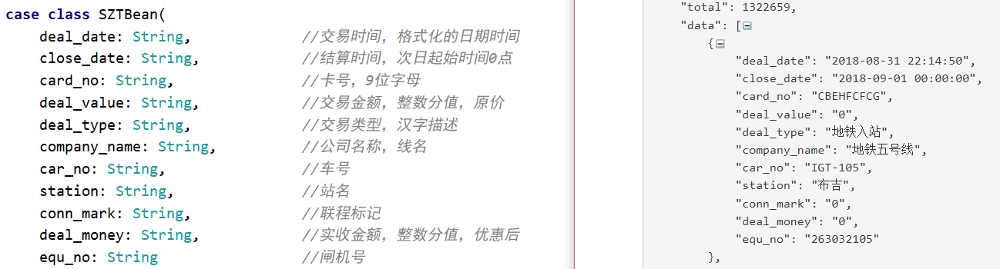

---

#### 2.2- 调用 `cn.java666.etlflink.app.Jsons2Redis` 将本地的Json数据存盘到redis中，目前还是原始数据

- 使用Flink进行处理，添加输入输出

  在本地运行Flink程序即可

- Source为readFromText(按行处理)

  Sink为RedisSink

- 数据在Redis中的存储以page为键Key，每个Key下存储一个json的值，一个json包含一千条地铁数据

  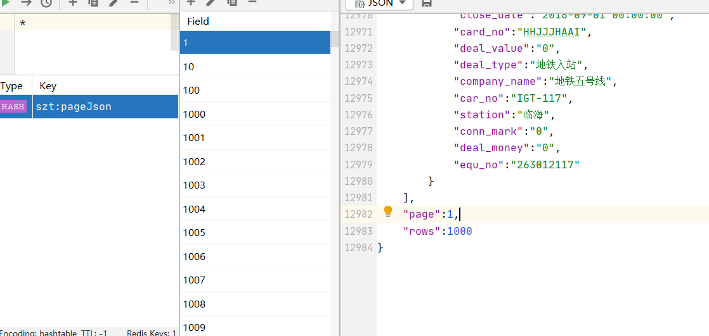


#### 2.3- `cn.java666.etlspringboot.EtlSApp#main` 启动后，也可以用 knife4j 在线调试 REST API：

http://127.0.0.1:6661/doc.html#/home

核对数据共1337页(redis中)

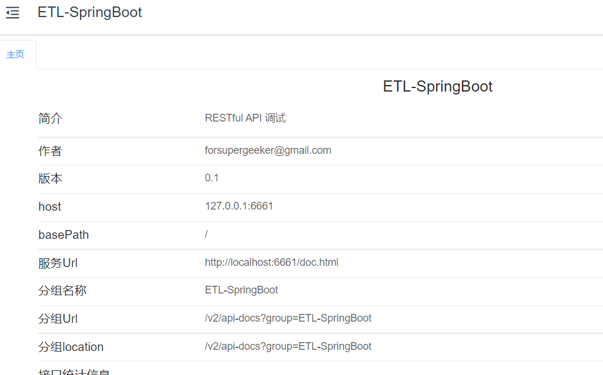

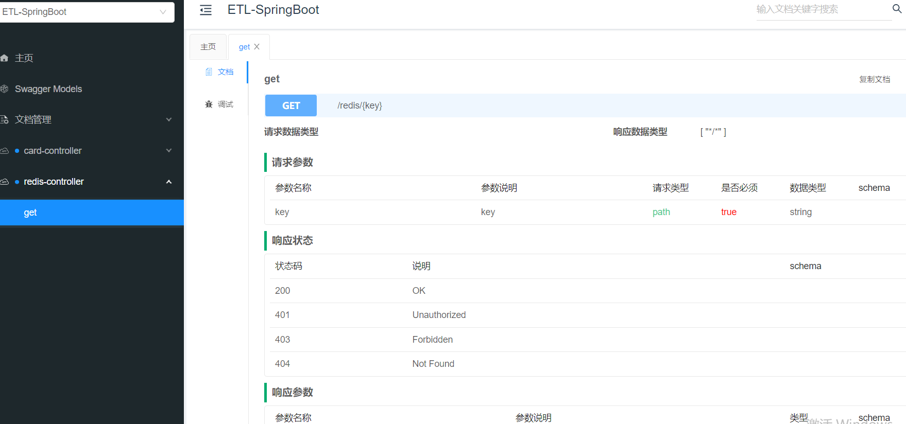

##### 关于knife4j

一个API管理工具，会提供Web页面

使用knife4j需要一个swagger的配置类，这个配置类和以前使用swagger几乎是一样的。

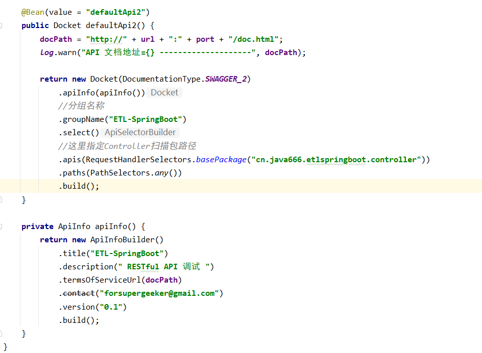

我们只需要在其中指定我们的Controller包名即可自动扫描

#### 2.4- `cn.java666.etlflink.source.MyRedisSourceFun#run` 清洗数据发现 133.7 万数据中，有小部分源数据字段数为9，缺少两个字段：station、car_no；丢弃脏数据。

我们通过自定义RedisSource来进行数据过滤，所有的数据导入app均以我们的RedisSource为基础，做到数据过滤的效果

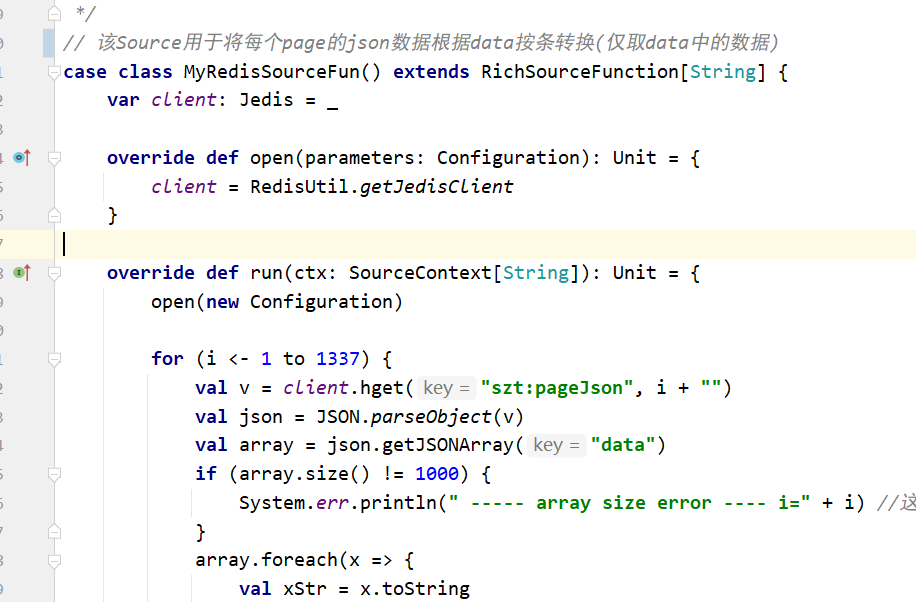

#### 2.5- `cn.java666.etlflink.app.Redis2XXX#main` 将原始数据ETL到各种存储介质

均采用RedisSource进行脏数据清洗

##### 1）、到Kafka(跑实时的时候用，模拟一条条来)

根据需求推送满足业务要求的源数据到 kafka

`topic-flink-szt` 仅包含清洗合格的源数据 1266039 条。

使用Kafka-eagle进行数据监控

http://topview102:8048/  默认账号密码admin/123456

**实测会自动创建topic，但是我第一次运行报错了**，第二次才正常启动

所以我们最好还是需要手动创建一下分区

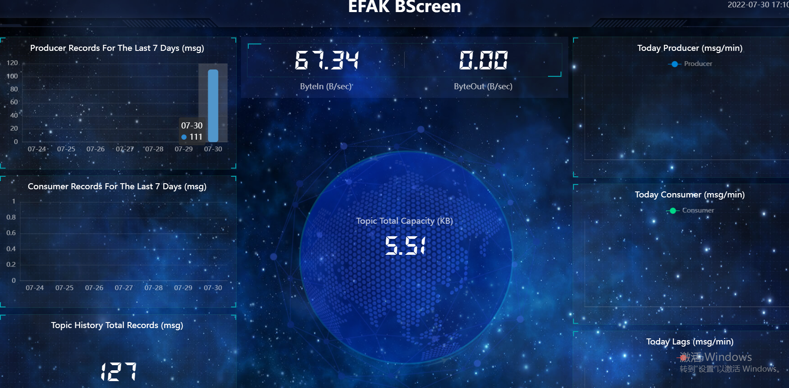

- 直接采用Flink提供好的Kafka Sink类


##### 2）、到CSV(用来放入HDFS，便于Hive读取)

`cn.java666.etlflink.app.Redis2Csv#main`实现了 flink sink csv 格式文件，并且支持按天分块保存

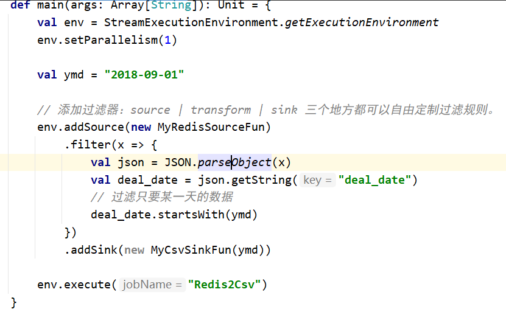

- 自定义一个CSVSinkFunction继承SinkFunction实现invoke方法

##### 3）、到ES(这里的数据用于检索分析，高效查询，建仓前先行分析)

`cn.java666.etlflink.app.Redis2ES#main` 实现了 ES 存储源数据。

**实现实时全文检索**，实时跟踪深圳通刷卡数据。便于数据分析

- 启动ES前必须先su es切换非root用户

- **使用kibana 进行数据检查和分析(Kibana和ES版本一致为7.8.0)**

  为了能在kibana正确显示时间戳，需要在将数据上传至ES之前，配置好mapping映射(提前指定表结构，否则ES自动指定)

  表结构如下

  ````json
  // 只需要配置一个字段，其他字段会自动补充
  {
    "properties": {
  	"deal_date": {
  	  "format": "yyyy-MM-dd HH:mm:ss",
  	  "type": "date"
  	}
    }
  }
  ````

  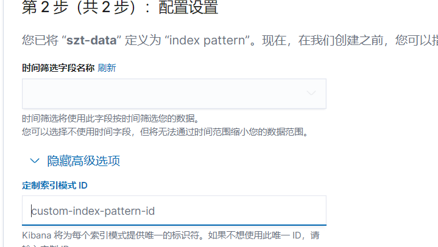

- **分析结果如图**

  发现晚高峰吻合，早高峰数据似乎丢失

  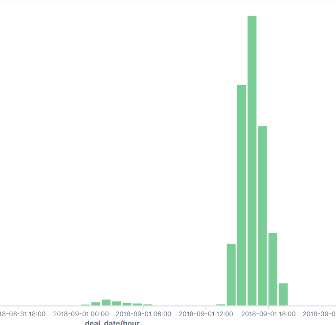

- Source为Redis的Source(此处完成脏数据过滤)

  Sink为ElasticsearchSink，自己实现MyESSinkFun()

- 关于JSON的序列化和反序列化

  

  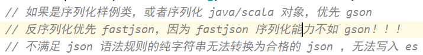

#### 2.6- 查看 ES 数据库卡号，对比自己的深圳通地铁卡，发现了一些脱敏规律。

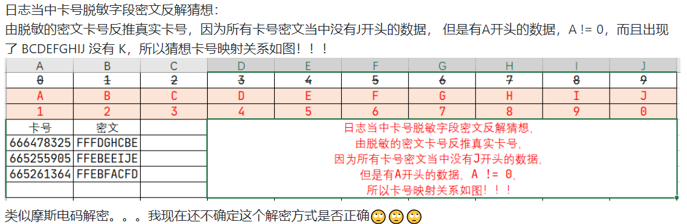

### 3- 搭建数仓：深圳地铁数仓建模

#### 3.1- 第一步，分析业务


